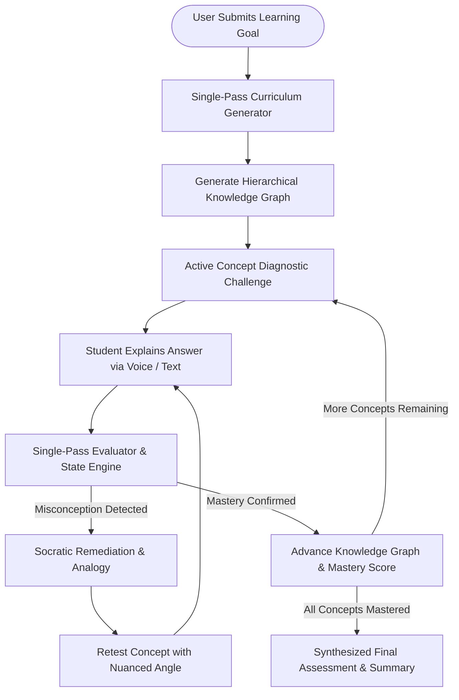
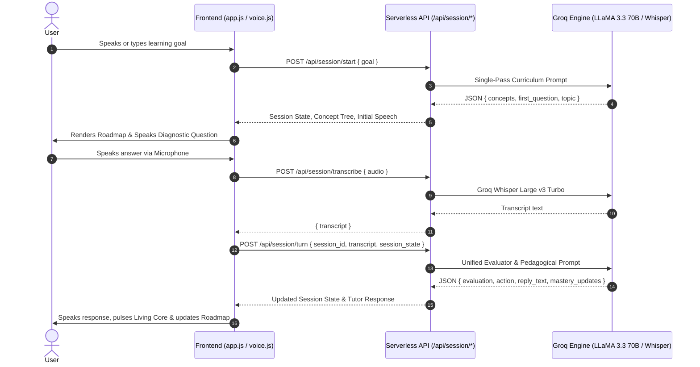

# Mentora — Voice-First AI Tutor

<p align="center">
  
</p>

<p align="center">
  <strong>An adaptive, voice-first AI tutor that diagnoses understanding, detects misconceptions, and verifies real learning through Socratic dialogue.</strong>
</p>

---

## 📑 Table of Contents
* [Guide](#-for-everyone-non-technical-guide)
  * [What is Mentora?](#-what-is-mentora)
  * [How to Use the App](#-how-to-use-the-app)
  * [How the Socratic Learning Loop Works](#-how-the-socratic-learning-loop-works)
* [For Developers & Tech Teams](#-for-developers--tech-teams)
  * [Core Technical Features](#-core-technical-features)
  * [System Data Flow](#-system-data-flow)
  * [Mathematical Mastery Calculation](#-mathematical-mastery-calculation)
  * [Installation & Local Setup](#-installation--local-setup)

---

## 🌍 Guide

### 💡 What is Mentora?
Most educational AI tools act as **passive encyclopedias**—they generate overwhelming walls of text when asked a question, leaving the student in a passive reading state with zero verification of whether comprehension actually took place.

**Mentora reverses this dynamic:**
* **Active Dialogue**: Mentora teaches in concise conceptual bursts (2–3 sentences) and immediately poses diagnostic questions to probe the student's mental model.
* **Cognitive Diagnosis**: It listens to the student's spoken answer, evaluates depth of reasoning, isolates foundational misconceptions, and adapts the learning trajectory in real time.
* **Verification of Learning**: Concepts are marked as *Mastered* only when the student successfully demonstrates understanding through explanation and application.

---

### 🚀 How to Use the App
You don't need to know how to code to use Mentora! You can access it immediately:

1. Open the **[Vercel Live App Link](https://mentora-voice-tutor.vercel.app)** in any modern web browser (Google Chrome or Microsoft Edge are recommended for best voice features).
2. Type in a topic you want to learn (e.g. *Neural Networks*, *Distributed Systems*, or *Macroeconomics*) and click `→`.
3. The AI will outline a tailored **Learning Roadmap** on the right side of the screen.
4. **Start Speaking**: Click the large microphone button at the bottom of the screen to talk directly to the AI, explain concepts in your own words, and answer its Socratic questions.

---

### 🔄 How the Socratic Learning Loop Works
Mentora acts like a private human tutor. Instead of grading you with a simple "yes/no" or "pass/fail," it guides your learning path dynamically:



* **If you understand a concept**: Mentora moves forward on the roadmap and updates your **Mastery Score**.
* **If you have a gap or misunderstanding**: Mentora detects the exact misconception, changes its teaching style (giving you an intuitive analogy or a counter-question), and helps you correct it before advancing.

---

## 💻 For Developers & Tech Teams

### 🛠️ Core Technical Features
* **Sub-Second Voice AI Pipeline**: Unified Web Audio API `MediaRecorder` captures audio, sends it to a Node.js backend, and transcribes it using Groq's low-latency `whisper-large-v3-turbo` model.
* **Natural Speech Synthesis (TTS)**: Web Speech Synthesis integration with customizable accents and speed sliders.
* **Dynamic Knowledge Graph**: Interactive SVG Concept Tree rendering node statuses (`locked`, `in-progress`, `gap-detected`, `mastered`) synced with the backend model.
* **Reactive Neural Core**: Interactive HTML5 Canvas 2D background core animating harmonic wave equations responsive to voice amplitude and system states.
* **Session Persistence**: Full curriculum progress, turn histories, and mastery scores persist in `localStorage` across page reloads.

---

### 📐 System Data Flow



Here is a step-by-step breakdown of how the data travels across the system:

1. **Initial Setup (Steps 1–6)**: The user submits their learning goal. The browser asks the server to start a session, which prompts LLaMA 3.3 to build the custom roadmap and generate the first question. This roadmap and question are returned to the browser, which renders the tree and speaks the question aloud.
2. **Audio Processing (Steps 7–12)**: The user clicks the microphone and answers. The browser records their voice and sends it to the server, which transcribes it into text using Groq's high-speed Whisper model and returns the transcript.
3. **Dialogue & Grading (Steps 13–16)**: The browser sends the text response back to the server. The AI evaluates the answer to check for understanding, decides whether the concept is mastered or needs Socratic remediation (via analogies/hints), updates your score, and generates the tutor's reply. The browser then speaks the response and updates the visual roadmap.

---

### 📊 Mathematical Mastery Calculation

Mentora computes your overall understanding percentage dynamically using a normalized, weighted concept formula:

$$\text{Mastery Score } (%) = \left( \frac{\sum_{i=1}^{N} w_i}{N} \right) \times 100$$

*(In plain English: Your overall mastery score is the average of all these weights across your entire roadmap, converted to a percentage. You only reach 100% mastery when every single concept on your roadmap has been fully **Mastered**!)*

Where $N$ is the total count of curriculum nodes, and $w_i$ represents the discrete state weight of concept $i$:

| Concept Status | State Weight ($w_i$) | Pedagogical Meaning |
| :--- | :---: | :--- |
| `NOT_STARTED` | `0.00` | Unvisited concept |
| `IN_PROGRESS` | `0.35` | Concept currently under active evaluation |
| `GAP_DETECTED` | `0.15` | Active misconception being Socraticly remediated |
| `MASTERED` | `1.00` | Verified comprehension and successful explanation |

---

### ⚙️ Installation & Local Setup

#### Prerequisites
* **Node.js** $\ge 18.0.0$
* **Groq API Key** (Free at [https://console.groq.com/keys](https://console.groq.com/keys))

#### 1. Clone the Repository
```bash
git clone https://github.com/meriltitus/Mentora.git
cd Mentora
```

#### 2. Install Dependencies
```bash
npm install
```

#### 3. Configure Environment Variables
Copy `.env.example` to `.env`:
```bash
cp .env.example .env
```

Open the newly created `.env` file and input your Groq API key:
```env
LLM_PROVIDER=groq
GROQ_API_KEY=gsk_your_actual_key_here
```

#### 4. Run the Server
```bash
npm start
```
Your server will start on **`http://localhost:3000`**. Open that link in your browser to start learning locally!

---

## 📄 License
This project is licensed under the MIT License — see the [LICENSE](LICENSE) file for details.
