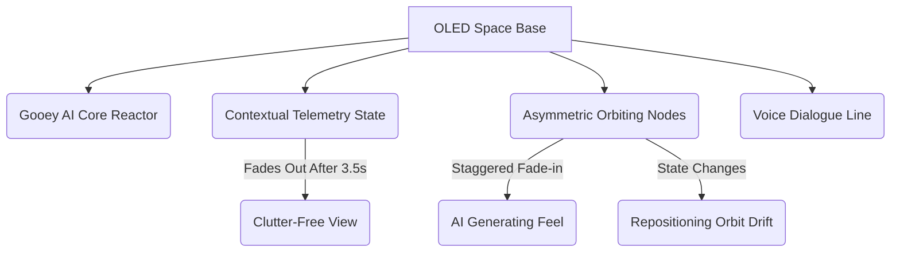

# Walkthrough — Voice-First AI Learning Tutor UI Exploration

We have implemented **Concept D (Unified Core)** as the primary focus of the prototype. The codebase on your Desktop at [Desktop/voice-first-tutor/](file:///C:/Users/meril/Desktop/voice-first-tutor/) has been updated, and the local web server remains running at `http://localhost:8080/index.html`.

This design preserves Concepts A, B, and C so you can compare them side-by-side, but loads **Concept D** as the default landing view.

---

## Concept D Design Review

Concept D successfully merges the spacious minimalism of the Apple-style core with contextual intelligence feedback and a dynamically generated learning path.

### 1. Asymmetric Orbit Mapping
Instead of a rigid grid or a symmetrical solar-system ring, the learning path materializes as floating node tags arranged in a **balanced but asymmetric cloud** surrounding the central core.
* **Repositioning Orbit Drift**: When a node becomes active, it subtly drifts closer to the core (representing focused attention), and mastered nodes shift slightly outward, creating a live, responsive visualization.
* **Organic Materialization**: When the learning path is generated, nodes fade in one-by-one with a staggered 200ms delay, making the map feel dynamically calculated by the AI.

### 2. Restrained State Colors
Colors are kept strictly quiet to maintain a premium, cinematic feel.
* **Unexplored**: 35% opacity, grey.
* **Active**: 100% opacity, solid white text, soft halo.
* **Conceptual Gap**: Desaturated amber outlines with a slow, breathing pulse transition (no flashing orange alerts or game-like indicators).
* **Mastered**: Faded emerald-green bullet indicator, letting the node blend into the background.

### 3. Contextual Jarvis Telemetry
* **High Sparsity**: Only one system state is displayed at a time (e.g. `[CONCEPTUAL GAP DETECTED]` or `[ANALYZING UNDERSTANDING]`).
* **Auto Fade-out**: The status pill fades in smoothly on transition, stays active for 3.5 seconds, and then silently fades to `opacity: 0` during regular voice dialogue.

### 4. Integrated Session Summary
* Rather than a separate SaaS card, the **Session Summary** is nested directly in the OLED space, gently fading in over the central orb.
* It displays only key conceptual statistics (concepts explored, gap resolution count) and highlights the next recommended learning task in a single monospace container.

---

## The 15-Step Journey Walkthrough
The **Simulation Center** now defaults to the new **Unified Journey** track. You can click `>` (Next) to experience the complete tutorial progression:

1. **Step 1: Awaiting Curiosity** (Idle white breathing orb, core is empty)
2. **Step 2: User Speaks** (Listening orb warps to voice frequency)
3. **Step 3: Understanding Goal** (Thinking steel-blue orb, status: `UNDERSTANDING YOUR GOAL`)
4. **Step 4: Building Roadmap** (Thinking orb accelerates, status: `BUILDING ROADMAP`)
5. **Step 5: Path Materializes** (Orb is speaking, nodes staggered-fade into orbit)
6. **Step 6: Teaching Concept** (Active node `Neurons` pulls closer, core speaking)
7. **Step 7: Listening to Explanation** (Core listening, user transcript prints)
8. **Step 8: Analyzing** (Thinking orb, status: `ANALYZING UNDERSTANDING`)
9. **Step 9: Conceptual Gap Detected** (Core glows amber, `Neurons` node drifts and pulses amber, status: `CONCEPTUAL GAP DETECTED`)
10. **Step 10: Probing** (Tutor speaks, asking targeted question to inspect the gap)
11. **Step 11: Correcting** (Tutor explains activation functions)
12. **Step 12: Retesting** (Core listening, student explains correct concept)
13. **Step 13: Mastery Confirmed** (Core flashes teal, node turns green/white, status: `MASTERY CONFIRMED`)
14. **Step 14: Moving Forward** (Active node shifts, advancing to `Activation Functions`)
15. **Step 15: Session Complete** (Nodes fade, integrated Session Summary overlay materializes)

---

## How to Access and Test
1. Open your browser and navigate to: **`http://localhost:8080/index.html`**
2. Use the **Simulation Center (🛠️)** to run through steps 1 to 15.
3. Compare with the previous concepts using the switcher navbar at the top at any time.
